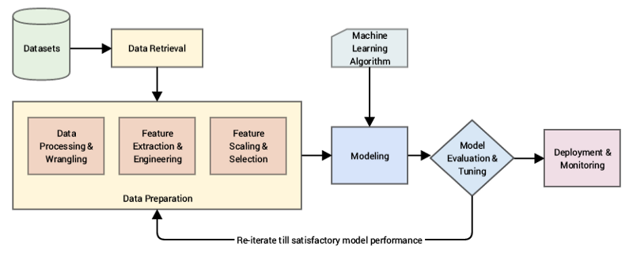
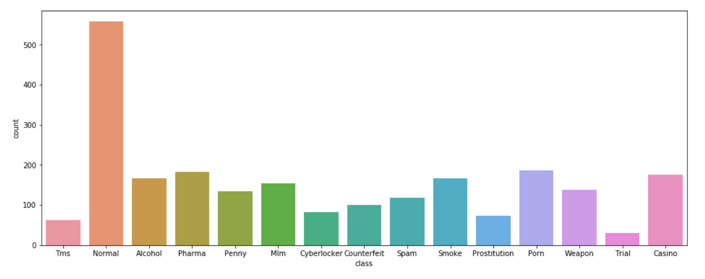
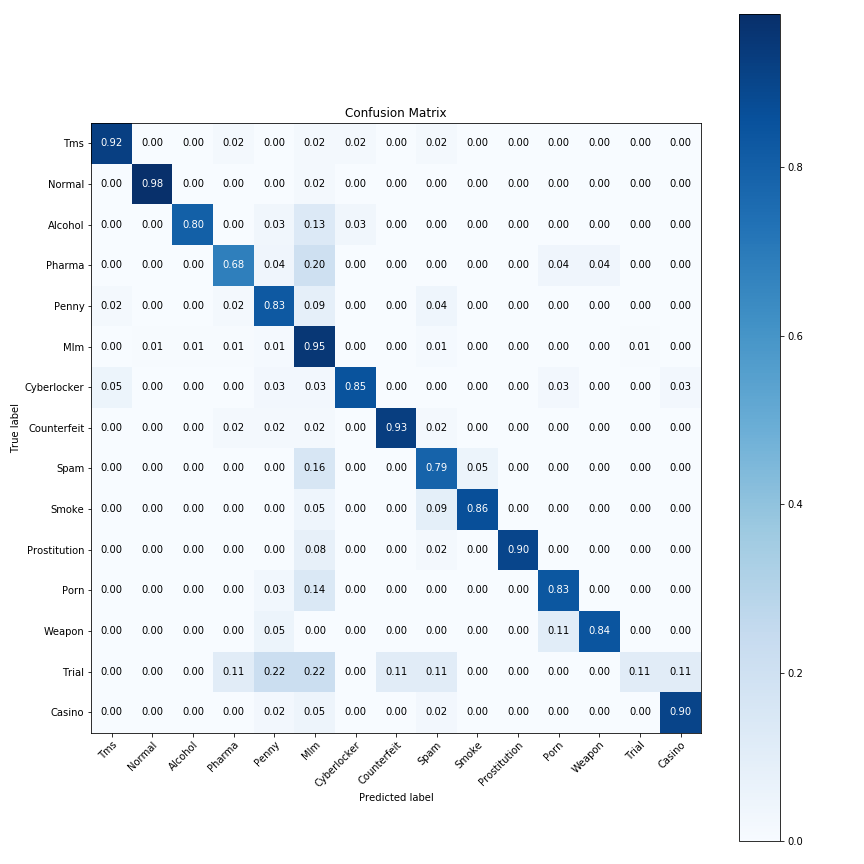

# Machine Learning: Web Classification
During my internship at Jewel Paymentech, I undertook an independent data science project to build a machine learning model that performs multi-class classfication of websites based on its text data.

## Project Objective
------
The objective of this project is to assist our clients in identifying various categories of potentially illegal or fraudulent website content such as pornography, gambling and multi-level marketing (based on the website's text content).

## Machine Learning Pipeline
------
This is an overview of a typical machine learning pipeline. To prepare my data for model training, I will be cleaning the text and perform text preprocessing.



## Data Exploration
------


</br>

## Data Cleaning
------
Clean text to remove irrelevant text such as non-letters, whitespace, HTML tags, and stopwords. Stopwords are commonly used words such as 'a', 'am', 'as', etc.
```python
def clean_text(raw_text, remove_stopwords=True):
  '''Clean text by removing HTML tags, non-letters, whitespace and stopwords (common words).'''

  html_text = BeautifulSoup(raw_text, 'html.parser').get_text()
  non_letters = re.sub('[^a-zA-Z]', ' ', html_text)
  words = non_letters.lower()
  words = ' '.join(words.split())
  words = words.split()
  if remove_stopwords:
      # 7. return a long string of words
      stops = set(stopwords.words('english'))
      words = [w for w in words if not w in stops]
  return words
```

## Text Processing: Word Lemmatization
------
Word lemmatization is a NLP technique used to transform a word into its root form, allowing grouping of similar words. E.g. the root form of 'walks', 'walked', 'walking' is equivalent to 'walk'.
```python
def word_lemmatization(text):
  '''Performs word lemmatization based on the most common position of the word'''
  lemm = WordNetLemmatizer()
  def get_pos(word):
    '''Retrieve a word's most common position'''
    w_synsets = wordnet.synsets(word)

    pos_counts = Counter()
    pos_counts["n"] = len([ item for item in w_synsets if item.pos()=="n"])
    pos_counts["v"] = len([ item for item in w_synsets if item.pos()=="v"])
    pos_counts["a"] = len([ item for item in w_synsets if item.pos()=="a"])
    pos_counts["r"] = len([ item for item in w_synsets if item.pos()=="r"])
		
    most_common_pos_list = pos_counts.most_common(3)
    return most_common_pos_list[0][0]
  
  return [WordNetLemmatizer().lemmatize(word, pos=get_pos(word)) for word in nltk.word_tokenize(text)]
```
</br></br></br></br>

## Train-Test Split
------
Splitting the data into training and testing sets is essential for evaluating predictive model's performance. The training set will be used to train the model while the testing data is used to evaluate the model's performance.
```python
# Train-Test Split (70:30)
X_train, X_test, y_train, y_test = train_test_split(X, y, test_size=0.3, random_state=1, stratify=y, shuffle=True)
```

## Machine Learning
------
Term Frequency-Inverse Document Frequency (TF-IDF) is an information retrieval technique used to normalize the frequencies of word occurences by scaling down the impact of words that frequently appears. 

The machine learning algorithm I used is _Linear Support Vector Classifier_.
```python
# TF-IDF Vectorizer
tfidf = TfidfVectorizer(encoding='latin-1', stop_words='english', lowercase=True, smooth_idf=False, sublinear_tf=True, use_idf=True))

# Machine learning model
svm = OneVsRestClassifier(LinearSVC(penalty='l2', C=1))
```

## Hyperparameter Optimization
------
Performs search on various hyperparameters to find the optimal set of parameters that enhances the model's performance.
```python
# Model Pipeline
clf_pipeline = Pipeline([
    ('tfidf', TfidfVectorizer(encoding='latin-1', lowercase=True, stop_words='english'),
    ('clf', LinearSVC())
])

# Hyperparameters to search through
parameters = {
    'tfidf__norm': [None, 'l1', 'l2'],
    'tfidf__use_idf': [False, True],
    'tfidf__smooth_idf': [False, True],
    'tfidf__sublinear_tf': [False, True],
    'tfidf__ngram_range': [(1, 1), (1, 2)],
    "svm__estimator__C": [0.01, 0.1, 1],
    "svm__estimator__class_weight": ['balanced', None]
}

# Grid Search Cross Validation to search and find the optimal set of parameters with the best validation score
grid = GridSearchCV(clf_pipeline, parameters, n_jobs=-1, cv=3, scoring='f1_weighted')
```

## Model Evaluation
------
Metrics used to evaluate a classification model include precision,recall, and f1-score. The following below is a normalized confusion matrix which describes the performance of a classification model for each class.

Based on the confusion matrix, the model performs generally well on most classes except for the 'Trial' class. This is due to the small amount of samples we have for the 'Trial' class. As such, to further improve the model performance, it is suggested to collect more training data on the 'Trial' class.
